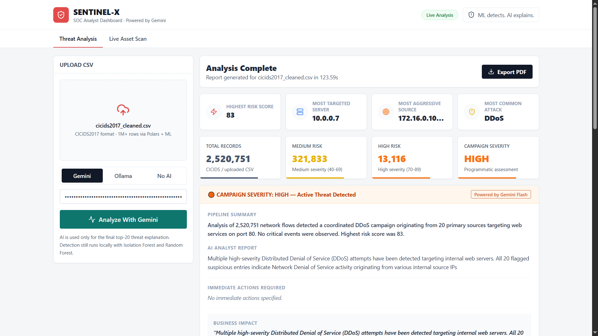
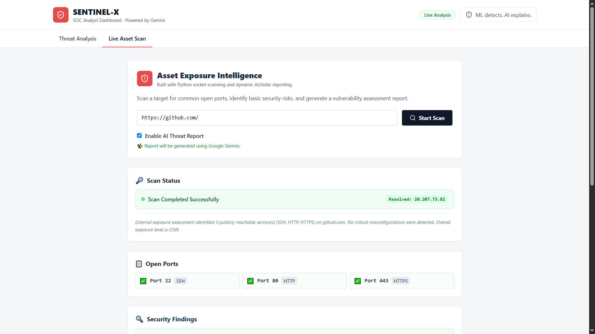
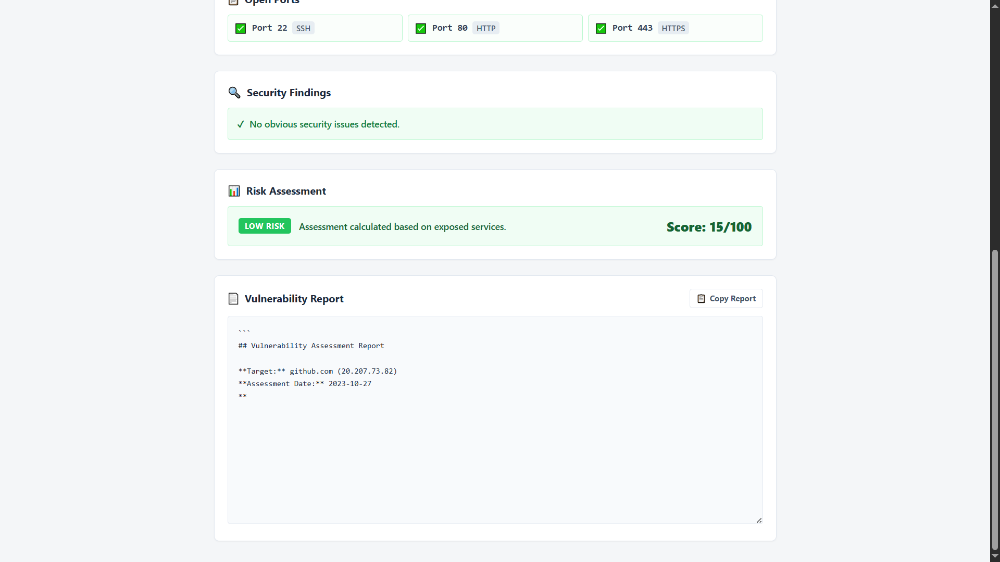
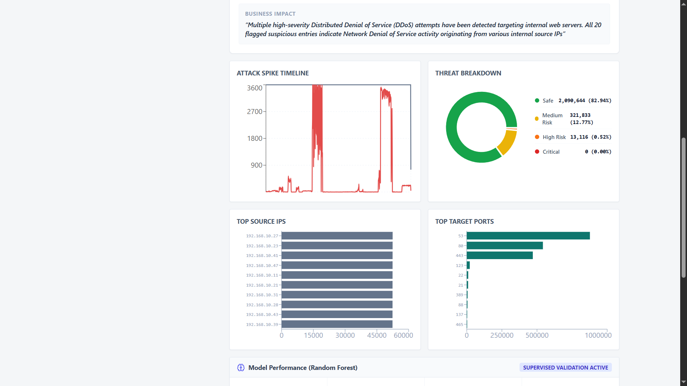
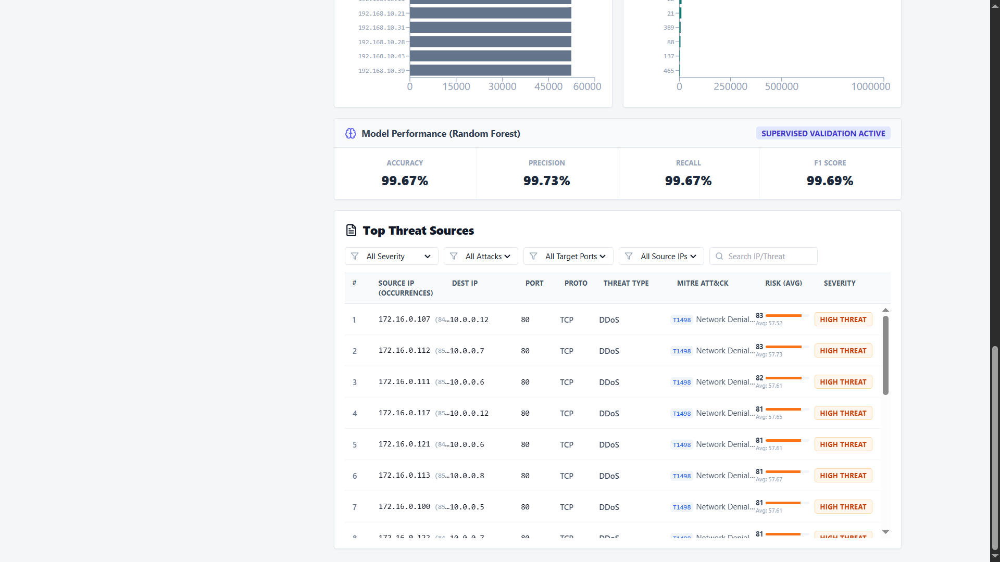

# Sentinel-X AI SOC Analyst

AI-powered Security Operations Center (SOC) platform for network threat detection, asset exposure intelligence, machine learning-based security analytics, MITRE ATT&CK mapping, and automated SOC reporting.



---

## Overview

Sentinel-X is a full-stack cybersecurity platform designed to help security analysts identify threats, assess asset exposure, and generate executive security reports.

The platform combines:

- Isolation Forest anomaly detection
- Random Forest threat classification
- MITRE ATT&CK mapping
- AI-powered threat analysis using Google Gemini
- Interactive SOC dashboards
- Automated PDF report generation

---

## Key Features

### Threat Analysis Engine

- Isolation Forest anomaly detection
- Random Forest threat classification
- Risk scoring engine
- Threat severity categorization
- MITRE ATT&CK technique mapping
- AI-generated analyst explanations

### Asset Exposure Intelligence

- Live host scanning
- Port exposure assessment
- Asset risk scoring
- Vulnerability assessment
- Exposure intelligence reporting

### AI Security Reporting

- Google Gemini integration
- Executive security summaries
- Business impact analysis
- Threat remediation guidance
- Automated PDF SOC reports

### Security Analytics Dashboard

- Attack spike timeline
- Threat distribution analysis
- Top source IP identification
- Target port analytics
- ML model performance monitoring

---

## Technology Stack

### Frontend

- React
- TypeScript
- Vite
- Tailwind CSS

### Backend

- FastAPI
- Python
- Pandas
- Polars
- Scikit-Learn

### Machine Learning

- Isolation Forest
- Random Forest
- Threat Intelligence Engine

### AI

- Google Gemini

---

## Architecture

```text
Network Traffic Dataset
          │
          ▼
   Data Processing
          │
          ▼
  Isolation Forest
  (Anomaly Detection)
          │
          ▼
   Random Forest
 (Threat Detection)
          │
          ▼
 Threat Intelligence
          │
          ▼
  Gemini AI Analysis
          │
          ▼
 SOC Dashboard + PDF Reports
```

---

## Screenshots

### Threat Analysis Dashboard


### Asset Exposure Intelligence



### Asset Scan Results



### Threat Visualization



### Threat Investigation Table



---

## Sample SOC Report

Sentinel-X automatically generates professional SOC intelligence reports.

📄 Sample PDF Report:

[View Sample Report](Sample-Reports/SENTINEL-X-SOC-Report-Sample.pdf)

Report includes:

- Executive Dashboard
- AI Threat Analysis
- MITRE ATT&CK Mapping
- Top Threat Events
- Network Intelligence
- Risk Assessment
- ML Performance Metrics
- Security Recommendations

---

## Machine Learning Performance

Using the CICIDS2017 dataset:

| Metric | Score |
|----------|----------|
| Accuracy | 99.67% |
| Precision | 99.73% |
| Recall | 99.67% |
| F1 Score | 99.69% |

---

## Example Detection Results

| Metric | Value |
|----------|----------|
| Records Analyzed | 2,520,751 |
| Highest Risk Score | 83 |
| Medium Risk Events | 321,833 |
| High Risk Events | 13,116 |
| Most Common Attack | DDoS |
| Campaign Severity | HIGH |

---

## Installation

### Clone Repository

```bash
git clone https://github.com/irfanahmed0019/sentinel-x-ai-soc-analyst.git

cd sentinel-x-ai-soc-analyst
```

---

### Backend Setup

```bash
cd backend

pip install -r requirements.txt

uvicorn main:app --reload
```

Backend:

```text
http://localhost:8000
```

---

### Frontend Setup

```bash
cd frontend

npm install

npm run dev
```

Frontend:

```text
http://localhost:5173
```

---

## MITRE ATT&CK Coverage

Current detections include mappings such as:

| Technique | Description |
|------------|-------------|
| T1498 | Network Denial of Service |
| T1499 | Endpoint Denial of Service |
| T1046 | Network Service Discovery |
| T1110 | Brute Force |

---

## Project Structure

```text
sentinel-x-ai-soc-analyst/

├── backend/
├── frontend/
├── Screenshots/
├── Sample-Reports/
├── README.md
└── .gitignore
```

---

## Future Improvements

- Docker deployment
- Real-time packet capture
- SIEM integration
- Threat intelligence feeds
- Multi-user authentication
- Case management workflow
- Kubernetes deployment
- RBAC support
- Alerting engine

---

## Author

Irfan Ahammad J

GitHub:
https://github.com/irfanahmed0019

---

## License

MIT License
